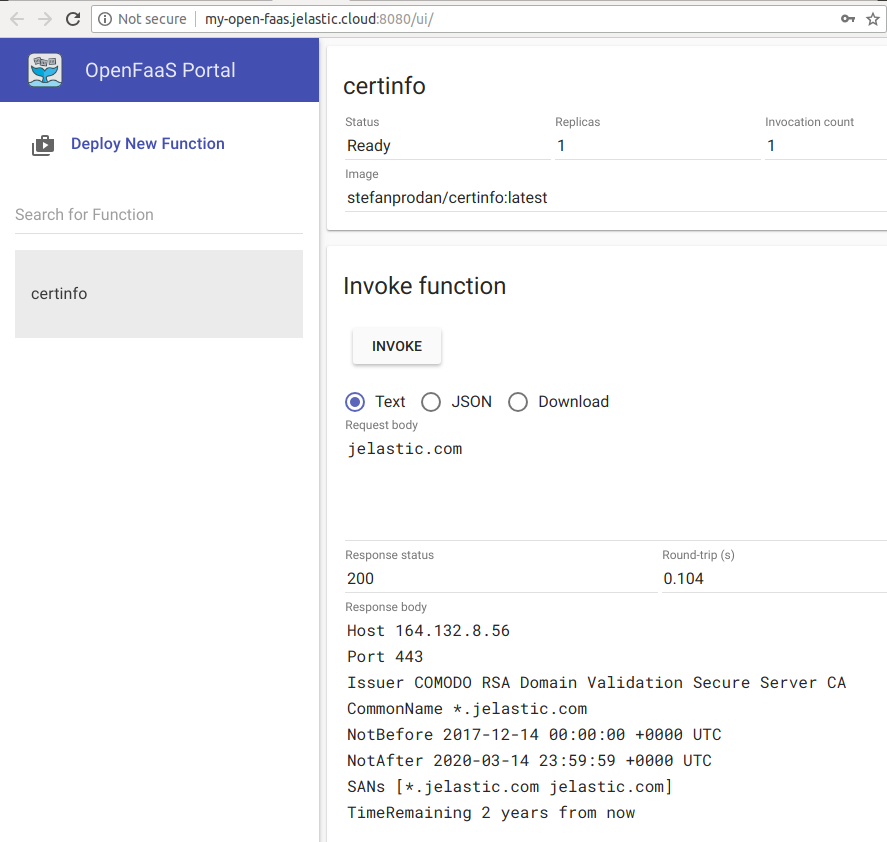

 

# OpenFaas (Functions-as-a-Service) - Serverless Functions

Import the required manifest using the link from GitHub:
[https://github.com/jelastic-jps/openfaas/blob/master/manifest.jps](https://github.com/jelastic-jps/openfaas/blob/master/manifest.jps)

 

In the installation wizard, if required, change settings such as *Environment Name* or *Region*. Then press __Install__ .

 

After the completion press __Open in Browser__ button. The default port is __:8080__.  

 

## Deploy Now

Press __Deploy__ to get an account and deploy to a certified Jelastic partner from the distributed network of independent data center service providers. 

 

**Note**: The package is compatible with Jelastic 5.4 build 8+. 

## OpenFaaS Managed Hosting Business

To start offering this solution to your customers please follow to [Managed PaaS Hosting Business](https://jelastic.com/apaas/) 
